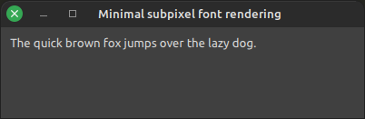

# OpenGL 4.5 subpixel text rendering with sbt_truetype

This is a small companion demo for the blog post [Simple good quality subpixel text rendering in OpenGL with stb_truetype and dual source blending][1].
It's a straight forward implementation of subpixel text rendering with dual source blending to blend each subpixel individually.
Reasonable good quality for very low complexity.

[1]: http://arkanis.de/weblog/2023-08-14-simple-good-quality-subpixel-text-rendering-in-opengl-with-stb-truetype-and-dual-source-blending

The code is mostly just one big chunk in the `main()` function without any abstractions.
The blog post explains the high-level picture and this demo project is mostly just to make sure that all the nitty-gritty details are available if someone wants them.
So no abstractions, you would just have to crack them open anyway to understand what's really happening.
Unusual and maybe not "pretty", but spares you from tracking all those indirections in your head.

## Building

- The project is meant for Linux and Windows. No idea if it works on Mac or not.
- On Linux Mint you'll need the packages libx11-dev libxext-dev libopengl-dev to compile the program
  - `sudo apt install libx11-dev libxext-dev libopengl-dev`
  - libx11-dev and libxext-dev are for the libSDL X11 driver. If your distribution uses something else you'll need different packages there.
- On Windows I use the w64devkit-mini release from [skeeto/w64devkit](https://github.com/skeeto/w64devkit). Ist just a ZIP archive with GCC, make, busybox, etc.
- Clone or download the repo and run `make`.  
  This will automatically download (and on Linux compile) SDL and then the demo itself.
